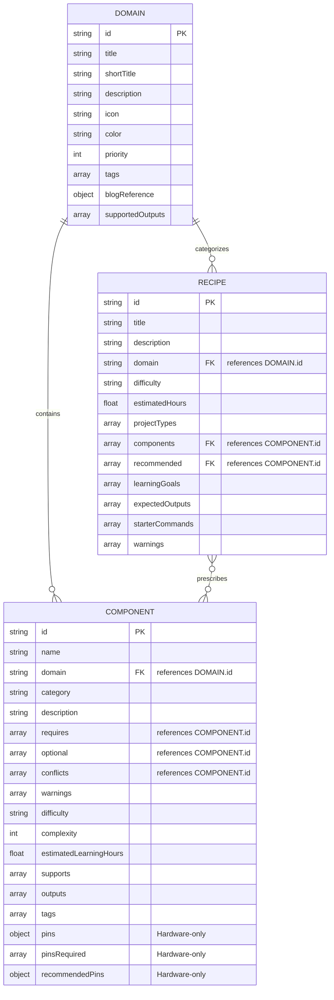

# Ediccrew Tech Stack Architect: Engine Database Specification

This document provides the formal data architecture, schema specifications, entity relations, and business validation logic of the flat-file database driving the **Ediccrew Tech Stack Architect Engine**.

---

## 1. Architectural Overview

The Ediccrew Tech Stack Architect utilizes a declarative, zero-dependency flat-file JSON registry system. This design enables high portability, simplified local hosting, offline support (e.g., inside Termux or Pydroid environments), version-controlled schemas via Git, and zero run-time database engine overhead.

The data layer is partitioned into three decoupled registries located in the [data](file:///data/data/com.termux/files/home/storage/shared/tech-stack-architect/data) directory:
1. **[domain.json](file:///data/data/com.termux/files/home/storage/shared/tech-stack-architect/data/domain.json)**: The Domain Registry, defining the foundational engineering tracks.
2. **[components.json](file:///data/data/com.termux/files/home/storage/shared/tech-stack-architect/data/components.json)**: The Component Database, housing all granular technology nodes, dependencies, conflicts, warnings, and hardware parameters.
3. **[recipes.json](file:///data/data/com.termux/files/home/storage/shared/tech-stack-architect/data/recipes.json)**: The Recipe Blueprints, mapping curated blueprints that group components to meet specific engineering goals.



---

## 2. Entity Schemas & Data Dictionaries

### 2.1. Domain Registry (`domain.json`)

Defines the overarching engineering domains that filter components and recipes in the user interface.

#### JSON Schema
```json
{
  "$schema": "http://json-schema.org/draft-07/schema#",
  "title": "DomainRegistry",
  "type": "array",
  "items": {
    "type": "object",
    "properties": {
      "id": { "type": "string", "description": "Unique URL-friendly slug identifier." },
      "title": { "type": "string", "description": "Human-readable descriptive title." },
      "shortTitle": { "type": "string", "description": "Abbreviated label used in UI layout tabs." },
      "description": { "type": "string", "description": "Contextual description of the engineering domain." },
      "icon": { "type": "string", "description": "Emoji graphical representation." },
      "color": { "type": "string", "pattern": "^#[0-9A-Fa-f]{6}$", "description": "Hex color code for UI cards and active tabs." },
      "priority": { "type": "integer", "description": "Display order index." },
      "tags": {
        "type": "array",
        "items": { "type": "string" },
        "description": "General keywords associated with the domain."
      },
      "blogReference": {
        "type": "object",
        "properties": {
          "title": { "type": "string", "description": "Recommended article headline." },
          "slug": { "type": "string", "description": "Relative URL path to the article." }
        },
        "required": ["title", "slug"]
      },
      "supportedOutputs": {
        "type": "array",
        "items": { "type": "string" },
        "description": "Output formats generated for configurations in this domain."
      }
    },
    "required": ["id", "title", "shortTitle", "description", "icon", "color", "priority", "tags", "blogReference", "supportedOutputs"]
  }
}
```

#### Data Dictionary
| Field | Type | Description | Constraints |
| :--- | :--- | :--- | :--- |
| `id` | String | Unique slug identifier. | Primary Key, Lowercase & Kebab-case |
| `title` | String | Clear, descriptive domain name. | Non-empty |
| `shortTitle` | String | Brief title for UI spaces. | Max 20 chars |
| `description`| String | Long explanation of the domain. | Non-empty |
| `icon` | String | Character/Emoji icon representation. | Single character |
| `color` | String | CSS styling hex code. | Hex format `^#[0-9A-Fa-f]{6}$` |
| `priority` | Integer | Sorting weight. Lower is higher priority. | $\ge 1$ |
| `tags` | Array | Tags associated with the domain. | Unique string elements |
| `blogReference`| Object | Details of an associated tutorial. | Required fields: `title`, `slug` |
| `supportedOutputs`| Array | Supported output deliverables. | Enums: `architecture`, `starter-code`, `wiring-diagram`, etc. |

#### Database Entry Example
```json
{
  "id": "web-saas",
  "title": "Web Development & SaaS",
  "shortTitle": "Web & SaaS",
  "description": "Build modern websites, web applications, SaaS products, APIs, dashboards, and payment-enabled platforms.",
  "icon": "🌐",
  "color": "#2563EB",
  "priority": 1,
  "tags": ["frontend", "backend", "database", "cloud", "deployment", "performance", "seo", "payments"],
  "blogReference": {
    "title": "How to Build a SaaS MVP Without a Developer in 2026",
    "slug": "build-saas-mvp-without-developer-2026"
  },
  "supportedOutputs": ["architecture", "starter-code", "folder-structure", "deployment-guide", "learning-roadmap", "markdown", "json"]
}
```

---

### 2.2. Component Database (`components.json`)

Houses the physical components, services, frameworks, and hardware parts. It maps validation constraints, hardware parameters, and learning curves.

#### JSON Schema
```json
{
  "$schema": "http://json-schema.org/draft-07/schema#",
  "title": "ComponentDatabase",
  "type": "array",
  "items": {
    "type": "object",
    "properties": {
      "id": { "type": "string", "description": "Unique component slug." },
      "name": { "type": "string", "description": "Display name." },
      "domain": { "type": "string", "description": "Foreign key reference to domain.id." },
      "category": { "type": "string", "description": "Technological layer category." },
      "description": { "type": "string", "description": "Clear component explanation." },
      "requires": {
        "type": "array",
        "items": { "type": "string" },
        "description": "IDs of other components required to use this one."
      },
      "optional": {
        "type": "array",
        "items": { "type": "string" },
        "description": "IDs of optional but recommended helper components."
      },
      "conflicts": {
        "type": "array",
        "items": {
          "oneOf": [
            { "type": "string", "description": "Conflicting component ID." },
            {
              "type": "object",
              "properties": {
                "component": { "type": "string", "description": "Conflicting component ID." },
                "reason": { "type": "string", "description": "Context on why they are incompatible." }
              },
              "required": ["component"]
            }
          ]
        }
      },
      "warnings": {
        "type": "array",
        "items": { "type": "string" },
        "description": "Important architectural warnings."
      },
      "difficulty": { "type": "string", "enum": ["Beginner", "Intermediate", "Advanced"] },
      "complexity": { "type": "integer", "minimum": 1, "maximum": 5 },
      "estimatedLearningHours": { "type": "number", "minimum": 0 },
      "supports": {
        "type": "array",
        "items": { "type": "string" },
        "description": "Use cases or architectures supported."
      },
      "outputs": {
        "type": "array",
        "items": { "type": "string" },
        "description": "Code/Blueprint deliverables created by this component."
      },
      "tags": {
        "type": "array",
        "items": { "type": "string" }
      },
      "pins": {
        "type": "object",
        "properties": {
          "digital": {
            "type": "array",
            "items": { "type": "integer" },
            "description": "Available digital GPIO pin numbers."
          },
          "analog": {
            "type": "array",
            "items": { "type": "string" },
            "description": "Available analog pin identifiers (e.g. A0, A1)."
          }
        },
        "description": "Pins provided by microcontrollers."
      },
      "pinsRequired": {
        "type": "array",
        "items": { "type": "integer" },
        "description": "Hardware pin numbers required on the host board."
      },
      "recommendedPins": {
        "type": "object",
        "additionalProperties": { "type": "integer" },
        "description": "Safe alternative pin-mapping mappings."
      }
    },
    "required": ["id", "name", "domain", "category", "description", "difficulty", "complexity", "estimatedLearningHours", "supports", "outputs", "tags"]
  }
}
```

#### Data Dictionary
| Field | Type | Description | Constraints / Formats |
| :--- | :--- | :--- | :--- |
| `id` | String | Unique component slug. | Primary Key |
| `name` | String | Standard display name. | Non-empty |
| `domain` | String | Parent domain reference. | Foreign Key -> `domain.id` |
| `category` | String | Grouping layer. | E.g. `Database`, `Sensor`, `Hosting` |
| `description` | String | Component summary. | Clear text |
| `requires` | Array | Critical prerequisite component IDs. | List of keys from `components.json` |
| `optional` | Array | Optional helper component IDs. | List of keys from `components.json` |
| `conflicts` | Array | Component IDs that cannot co-exist. | String list OR Objects with `reason` |
| `warnings` | Array | Common caveats or optimization notes. | List of strings |
| `difficulty` | String | Learning barrier metric. | Enum: `Beginner`, `Intermediate`, `Advanced` |
| `complexity` | Integer | System complexity rating. | Value between `1` and `5` |
| `estimatedLearningHours`| Number | Expected hours to master. | Positive float |
| `supports` | Array | Target application workflows. | Unique strings |
| `outputs` | Array | Code/blueprint modules generated. | Unique strings |
| `pins` | Object | Microcontroller pin resources. | Keys: `digital` (int array), `analog` (string array) |
| `pinsRequired` | Array | Pin allocations required. | Array of ints representing occupied channels |
| `recommendedPins` | Object | Reassignment suggestions. | Dynamic key-value pairs (String -> Int) |

#### Database Entry Example (Software Component)
```json
{
  "id": "nextjs",
  "name": "Next.js",
  "domain": "web-saas",
  "category": "Frontend Framework",
  "description": "React framework optimized for server-side rendering, static generation, API routes, and modern SaaS applications.",
  "requires": ["nodejs", "vercel"],
  "optional": ["tailwindcss", "typescript"],
  "conflicts": [],
  "warnings": ["Avoid heavy real-time processing on the client. Use server actions, APIs, or background workers."],
  "difficulty": "Intermediate",
  "complexity": 3,
  "estimatedLearningHours": 35,
  "supports": ["website", "dashboard", "blog", "saas", "api"],
  "outputs": ["architecture", "starter-code", "deployment"],
  "tags": ["react", "seo", "ssr", "typescript"]
}
```

#### Database Entry Example (Hardware Component with Conflicts & Pins)
```json
{
  "id": "hc-sr04",
  "name": "HC-SR04",
  "domain": "mechatronics",
  "category": "Sensor",
  "description": "Ultrasonic distance sensor.",
  "requires": ["5v-power-bus"],
  "pinsRequired": [9, 10],
  "conflicts": [
    {
      "component": "l298n",
      "reason": "Pin 9 conflict"
    }
  ],
  "recommendedPins": {
    "trigger": 3,
    "echo": 4
  },
  "warnings": ["Move Trigger/Echo pins when using common motor driver layouts."],
  "difficulty": "Beginner",
  "complexity": 1,
  "estimatedLearningHours": 2,
  "supports": ["distance-measurement", "obstacle-avoidance"],
  "outputs": ["sensor-data"],
  "tags": ["sensor", "ultrasonic"]
}
```

---

### 2.3. Recipe Registry (`recipes.json`)

Curated technology bundles representing specific architectures (e.g. Bootstrapped Payment Dashboard, Obstacle Avoidance Robot).

#### JSON Schema
```json
{
  "$schema": "http://json-schema.org/draft-07/schema#",
  "title": "RecipeBlueprints",
  "type": "array",
  "items": {
    "type": "object",
    "properties": {
      "id": { "type": "string", "description": "Unique recipe slug identifier." },
      "title": { "type": "string", "description": "Descriptive title of the blueprint." },
      "description": { "type": "string", "description": "Explains what project the recipe creates." },
      "domain": { "type": "string", "description": "Foreign key reference to domain.id." },
      "difficulty": { "type": "string", "enum": ["Beginner", "Intermediate", "Advanced"] },
      "estimatedHours": { "type": "number", "minimum": 0 },
      "projectTypes": {
        "type": "array",
        "items": { "type": "string" }
      },
      "components": {
        "type": "array",
        "items": { "type": "string" },
        "description": "Prerequisite component IDs automatically selected."
      },
      "recommended": {
        "type": "array",
        "items": { "type": "string" },
        "description": "Helper component IDs suggested to supplement this stack."
      },
      "learningGoals": {
        "type": "array",
        "items": { "type": "string" }
      },
      "expectedOutputs": {
        "type": "array",
        "items": { "type": "string" }
      },
      "starterCommands": {
        "type": "array",
        "items": { "type": "string" },
        "description": "Shell commands to bootstrap this stack."
      },
      "warnings": {
        "type": "array",
        "items": { "type": "string" }
      }
    },
    "required": ["id", "title", "description", "domain", "difficulty", "estimatedHours", "projectTypes", "components", "recommended", "learningGoals", "expectedOutputs", "starterCommands", "warnings"]
  }
}
```

#### Data Dictionary
| Field | Type | Description | Constraints |
| :--- | :--- | :--- | :--- |
| `id` | String | Unique recipe identifier. | Primary Key |
| `title` | String | Recipe name. | Non-empty |
| `description` | String | Details on the project built. | Non-empty |
| `domain` | String | Target domain reference. | Foreign Key -> `domain.id` |
| `difficulty` | String | Learning path index. | Enum: `Beginner`, `Intermediate`, `Advanced` |
| `estimatedHours`| Number | Hours required to build. | Positive Float |
| `projectTypes` | Array | Types of projects this yields. | String tags |
| `components` | Array | IDs of base components. | Foreign keys -> `components.id` |
| `recommended` | Array | IDs of suggested options. | Foreign keys -> `components.id` |
| `learningGoals` | Array | Expected learning objectives. | String list |
| `expectedOutputs`| Array | Deliverables generated. | String list |
| `starterCommands`| Array | Commands to bootstrap the project. | Shell commands |
| `warnings` | Array | Caveats or security notifications. | String list |

#### Database Entry Example
```json
{
  "id": "bootstrapped-payment-dashboard",
  "title": "Bootstrapped Payment Dashboard",
  "description": "A lightweight SaaS dashboard suitable for startups validating an idea before scaling.",
  "domain": "web-saas",
  "difficulty": "Beginner",
  "estimatedHours": 8,
  "projectTypes": ["saas", "dashboard", "mvp"],
  "components": ["nextjs", "sqlite"],
  "recommended": ["tailwindcss", "typescript", "vercel"],
  "learningGoals": ["Server-side rendering", "Database fundamentals", "Deployment workflow"],
  "expectedOutputs": ["architecture", "folder-structure", "starter-code", "deployment-guide"],
  "starterCommands": [
    "npx create-next-app@latest ediccrew-mvp --typescript --tailwind --app",
    "npm install better-sqlite3",
    "npm run dev"
  ],
  "warnings": ["SQLite is ideal for MVPs but not high-concurrency production workloads."]
}
```

---

## 3. Relational Resolution & Logic Rules

### 3.1. Dependency Resolution (`dependencyEngine.js`)
Dependencies are modeled as a directed acyclic graph (DAG) where nodes represent component IDs:
- **Required Dependencies**: Transitive traversal via the `requires` array. When checking components, the `getRequiredDependencies(selected)` calculates the set union of all requirements.
- **Missing Dependencies**: Found by filtering all calculated dependencies against the list of currently selected components:
  $$\text{Missing} = \left( \bigcup_{c \in \text{Selected}} \text{requires}(c) \right) \setminus \text{Selected}$$

### 3.2. Conflict Resolution (`conflictEngine.js`)

Conflicts represent architectural mismatches, structural constraints, or physical limitations:

1. **Direct Component Incompatibilities**: Evaluates the `conflicts` array on selected component objects. If `source` has a conflict element referencing `target`, and both are selected, a conflict is registered.
2. **Hardware Pin Collisions**: Compares arrays of physical IO pins required by selected components (`pinsRequired`). If the intersection of pins between any two modules is non-empty, a high-severity collision is flagged:
  $$\text{Collisions} = \{ p \mid \exists c_1, c_2 \in \text{Selected}, c_1 \neq c_2 \text{ s.t. } p \in \text{pinsRequired}(c_1) \cap \text{pinsRequired}(c_2) \}$$
3. **Advanced Business Logic Rules**: The engine enforces hardcoded, cross-layer architectural validations:
   - **SQLite High Concurrency Limit (Severity: Medium)**: Flagged if `sqlite` AND `nextjs` AND `mcp-server` are concurrently chosen (heavy serverless workers conflict with file locking).
   - **Insecure Token Storage (Severity: High)**: Flagged if an `mcp-server` is configured without a `secure-token-vault`.
   - **Runtime Hosting Mismatch (Severity: High)**: Flagged if `pydroid3` (local Android Python runtime) is combined with `vercel` (cloud serverless hosting).
   - **Insufficient Motor Power Supply (Severity: High)**: Flagged if `arduino-uno` AND `l298n` (motor driver) are selected without `external-power-supply`.

---

## 4. Score Calculation & Architecture Quality Metric

The engine validates selection status using a scoring index starting at 100, deducting weights for architectural flaws and missing dependencies:

$$\text{Score} = 100 - (10 \cdot |\text{Missing}|) - (20 \cdot |\text{Component Conflicts}|) - (25 \cdot |\text{Pin Conflicts}|) - (10 \cdot |\text{Duplicates}|) - (15 \cdot |\text{Rule Violations}|)$$

The total score determines the configuration's **Build Status**:
- **Score $\ge 90$**: `Production Ready`
- **Score $75 \text{ to } 89$**: `Good`
- **Score $60 \text{ to } 74$**: `Needs Review`
- **Score $40 \text{ to } 59$**: `High Risk`
- **Score $< 40$**: `Invalid Configuration`

A configuration is marked as **Valid** if and only if $\text{Score} \ge 60$ and $\text{hasConflicts}$ is `false`.

---

## 5. Exporters and Extensibility

### 5.1. File Export Formats (`exporter.js`)
The `Exporter` serializes state reports dynamically:
- **JSON Exporter**: Dumps full project validations, scores, warnings, and blueprints into a formatted JSON string.
- **Markdown Exporter**: Outlines status, lists active components, enumerates warnings/rules, and maps terminal starter commands.

### 5.2. Runtime Extension Support (`PluginManager.js`)
The database can be augmented at runtime. Calling `registerPlugin(plugin)` appends custom components, registers new custom rules into the `Validator`, or maps new output formats/exporters without mutating the primary JSON database files.
